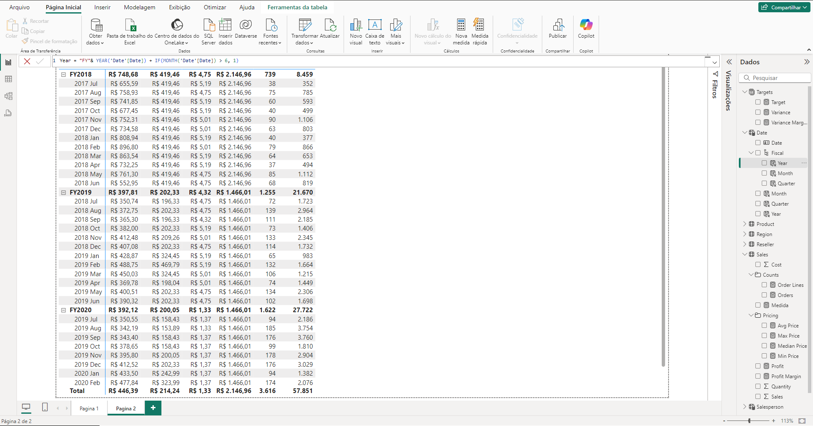

# Exemplo com Power BI e DAX

Nesse exemplo, modificamos um relatório do Power BI, para criar medidas simples, tabelas e colunas calculadas.

### [Arquivo Relatório](./Modified-Sales%20Analysis.pbix)

### [Link exercício](https://learn.microsoft.com/pt-br/training/modules/dax-power-bi-add-measures/5b-lab)

### [Download arquivos para exercício](https://github.com/MicrosoftLearning/PL-300-Microsoft-Power-BI-Data-Analyst/raw/Main/Allfiles/Labs/04-create-dax-calculations-in-power-bi-desktop/04-intro-dax.zip)