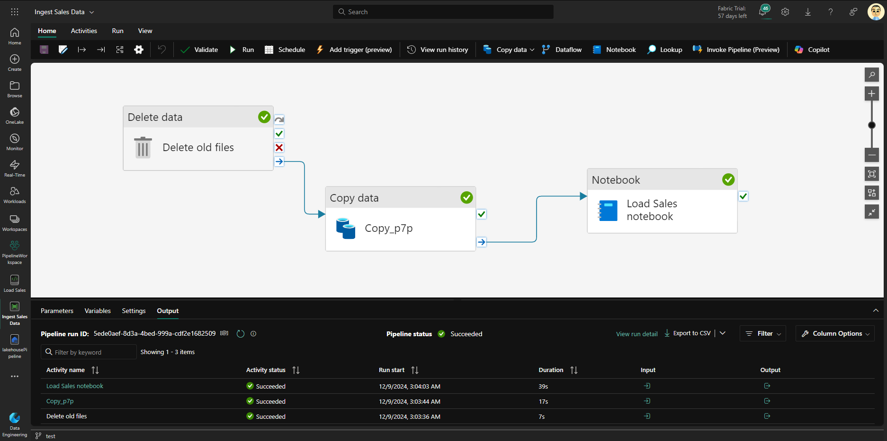

# Exemplo de Pipeline de dados

Nesse exemplo, criamos uma pipeline de dados, em que é uma sequência de etapas que serão feitas ao acionarmos ela.
Nessa pipeline, faremos a extração dos dados, depois com o notebook iremos transformar e carregar os dados transformados (pipeline ETL).

### [Arquivo zip da pipeline](./DeltaTablesNotebook.ipynb)

### [Link exercício](https://microsoftlearning.github.io/mslearn-fabric/Instructions/Labs/04-ingest-pipeline.html#criar-um-pipeline)

### [Download arquivos CSV com dados de vendas](https://raw.githubusercontent.com/MicrosoftLearning/dp-data/main/sales.csv)