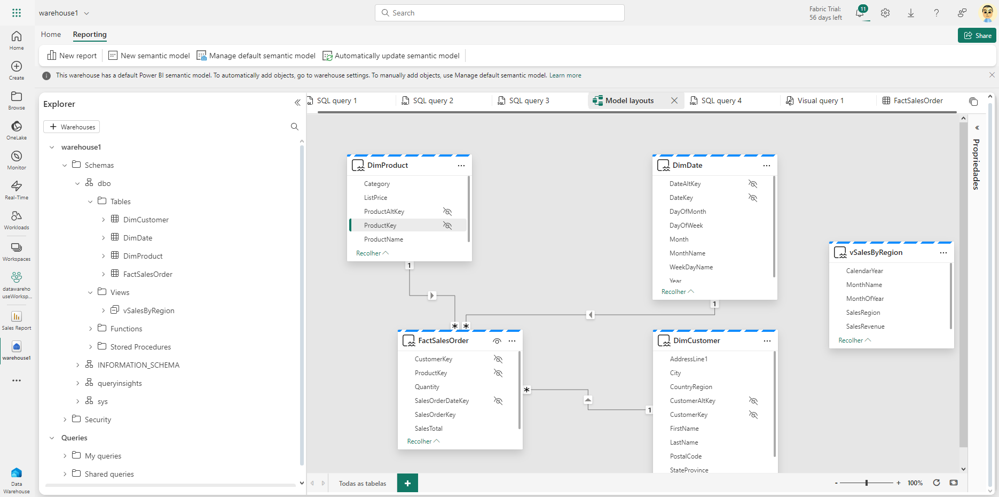

# Exemplo de relatório criado com Data Warehouse

Nesse exemplo, criamos um data warehouse e um relatório, para analisar os dados de lá.

### [Relatório](./Sales%20Report.Report/)

### [Link exercício](https://microsoftlearning.github.io/mslearn-fabric.pt-br/Instructions/Labs/06-data-warehouse.html)