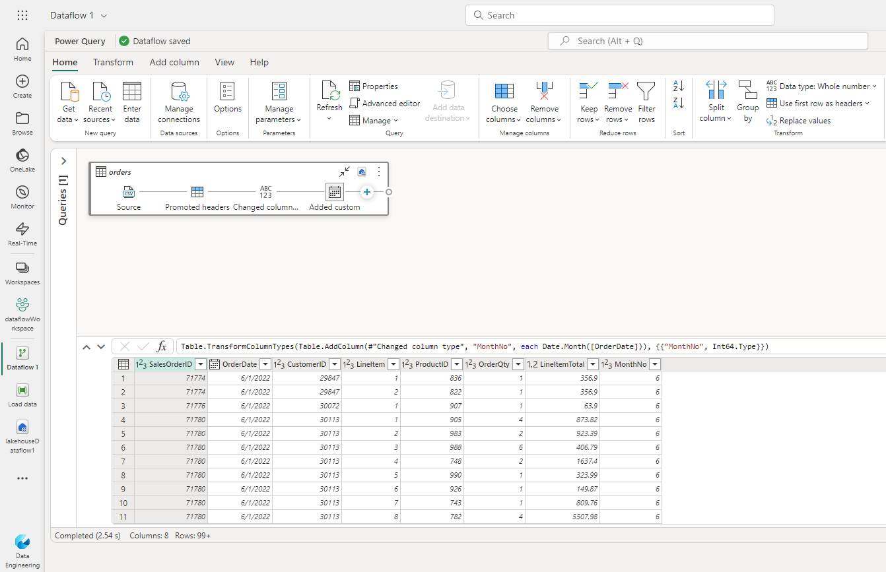

# Exemplo de Dataflow

Nesse exemplo, fazemos a ingestão de dados via Dataflow, em que já aplicamos a transformação dos dados e criamos uma pipeline somente com o Dataflow, para teste.

### [Template do Dataflow para Power Query](./dataflowExample.pqt)

### [Arquivo zip da Pipeline](./Load%20data.zip)

### [Link exercício](https://microsoftlearning.github.io/mslearn-fabric/Instructions/Labs/05-dataflows-gen2.html)

### [Download arquivos CSV com dados de vendas](https://raw.githubusercontent.com/MicrosoftLearning/dp-data/main/orders.csv)