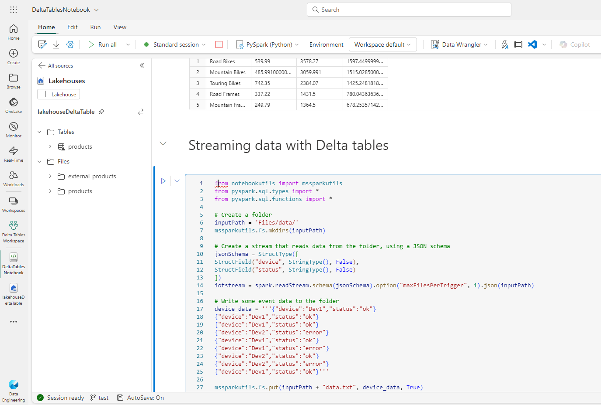

# Exemplo com Delta Tables

Nesse exemplo, criamos outro lakehouse, carregamos os dados de venda de arquivos CSV e criamos tabelas Delta, para testar o versionamento, analisar os dados e utilizar com streaming de dados.

### [Arquivo Notebook](./DeltaTablesNotebook.ipynb)

### [Link exercício](https://microsoftlearning.github.io/mslearn-fabric.pt-br/Instructions/Labs/03-delta-lake.html)

### [Download arquivos CSV com dados de vendas](https://github.com/MicrosoftLearning/dp-data/raw/main/products.csv)