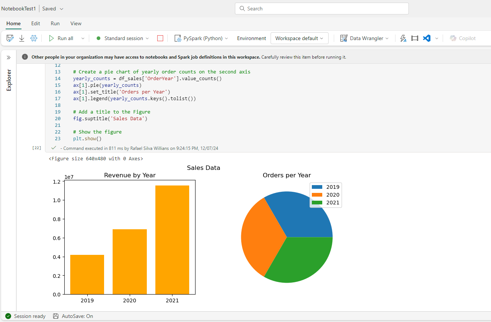

# Exemplo com Apache Spark

Nesse exemplo, criamos um lakehouse, carregamos os dados de venda de arquivos CSV e executamos consultas usando Spark e no final, SQL, além de criarmos gráficos com bibliotecas matplotlib e seaborn.

### [Arquivo Notebook](./SparkNotebook1.ipynb)

### [Link exercício](https://microsoftlearning.github.io/mslearn-fabric.pt-br/Instructions/Labs/02-analyze-spark.html#usar-o-spark-para-transformar-arquivos-de-dados)

### [Download arquivos CSV com dados de vendas](https://github.com/MicrosoftLearning/dp-data/raw/main/orders.zip)

